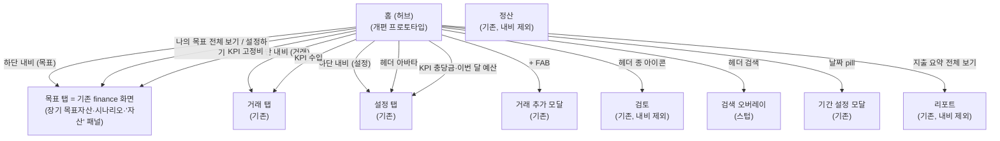

# 홈 개편 사용자 흐름 (스크린샷 기준)

> 구상 세션 산출물. 입력은 사용자가 제공한 홈 목표 스크린샷 2장(렌즈 2상태)이다.
> 현재 배포판이 아니라 **이 스크린샷이 개편 목표**라는 사용자 확인을 받았다.
> 갈림길 질문은 사용자가 즉답을 보류해 §4에 남기고, 전부 추천 기본값을 `가정`으로 적용해 진행한다.

- 흐름 이름: 홈 허브 개편 및 내비게이션 재구성
- 목적: 홈의 모든 카드·버튼이 "없거나 이상한 화면"으로 이어지지 않게, 스크린샷 구조 기준으로 연결점을 재정의한다.
- 상태: `draft` (§4 전항 `가정` 적용 중 — 사용자가 답하면 갱신)
- 마지막 갱신: 2026-07-24

## 1. 화면 그래프

> 정산(settle) 탭은 개편 전과 동일하게 하단 내비·홈에서 직접 진입점이 없다(범위 밖).

| 화면 | 구현 상태 | 연결된 계약서 |
| --- | --- | --- |
| 홈(허브, 스크린샷 구조로 개편) | 프로토타입 | `docs/ai/contracts/home.contract.md` (개편 반영 갱신 필요) |
| 목표 탭 (= 기존 finance 화면 재사용, 신설 아님) | 기존 | — |
| 검색 오버레이 | 스텁 | _(경화 시 작성)_ |
| 거래·설정·검토·리포트·정산 | 기존 | — |

## 2. 요소별 연결 (스크린샷 전수)

| 요소 | 목표 동작 | 현재 코드 | 상태 |
| --- | --- | --- | --- |
| 헤더 검색 | 검색 오버레이 열기 | `switch-tab tx` (거래 탭 이동 — "이상한" 연결) | `가정` Q3(a), 프로토타입=스텁 |
| 헤더 알림(종) | 검토(review) 진입 + 대기 건수 배지 | 동일 | 유지. review가 내비에서 빠지므로 유일 진입점 |
| 헤더 아바타 | 설정 탭 이동 | **동작 없음** | `가정` (신규 연결) |
| 날짜 pill | 기간 설정 모달 (2주↔달 전환 포함) | 모달 존재. 단 히어로에 별도 2주/달 세그먼트 중복 | 세그먼트 제거, 모달로 일원화 |
| 히어로 (i) 아이콘 | 계산 방식 설명 (툴팁/시트) | **존재하지 않음** | 스텁 |
| 렌즈 세그먼트 (써도 되는 돈/쓴 돈) | 히어로만 부분 갱신 | 동일 (`hero-lens`) | 유지 |
| 히어로 차트 | **렌즈별 상이**: 써도 되는 돈=남은 돈 감소 점선 곡선, 쓴 돈=누적 지출 상승 곡선 | 렌즈 무관 누적 지출 곡선 하나 | `가정` Q4(a), 프로토타입 구현 |
| 2주/달 세그먼트·분석 보기 버튼 | 스크린샷에 없음 → 제거 (분석 진입은 지출 요약 전체 보기로) | 존재 | 제거 |
| KPI 수입 | 거래 탭 (경화 시 수입 필터 적용 검토) | 거래 탭 | 유지 |
| KPI 충당금 | 설정 탭 충당금 섹션 | 설정 탭 충당금 섹션 | 유지 (목표=finance 탭에 충당금 섹션 없음) |
| KPI 고정비 | 목표(finance) 탭 — 현금흐름(저축 가능액) 맥락 | 리포트 탭 ("이상한" 연결 — 고정비 맥락 없음) | 변경 → finance |
| KPI 이번 달 예산 | 설정 탭 | 설정 탭 | 유지 (목표=finance 탭에 예산 섹션 없음) |
| 지출 요약 "전체 보기" | 리포트 탭 | 동일 | 유지. 카드 타이틀 "지출 카테고리"→"지출 요약" |
| 지출 요약 범례 행 | 카테고리 거래 모달 | 동일 (`open-category`, 기타 비클릭) | 유지 |
| 나의 목표 "전체 보기" | 목표(finance) 탭 | 설정 탭 | 변경 → finance |
| 목표 카드 | 목표 상세 모달 | 동일 (`open-goal-detail`) | 유지 |
| 미분류 "설정하기" | 목표(finance) 탭 | 설정 탭 | 변경 → finance |
| 포인트 행 / "자세히 보기" | 포인트 모달 | 동일 | 유지 |
| 하단 내비 | 홈 · 목표(finance) · (+) · 거래 · 설정 | 홈 · 목표(finance) · (+) · 거래 · 검토 | 검토→설정만 교체 |
| + FAB | 거래 추가 모달 | 동일 (`openTxAddModal`) | 유지 |

## 3. 목표 탭 = 기존 finance 탭 재사용 (신설 아님)

하단 내비의 "목표" 버튼은 원래부터 `data-tab="finance"`였다. 즉 **목표 탭은
이미 구현돼 있는 `render-finance.js` 화면**(장기 목표자산·시나리오·자산 트랙)이며,
개편 과정에서 이 탭을 새로 만들거나 성격을 바꾸지 않는다. 홈의 목표 관련 연결은
모두 이 기존 finance 화면으로 보낸다.

- 목표(finance) 탭 구성: 헤더 "목표 자산까지" 히어로 + `시나리오`/`자산` 세그먼트.
  - `시나리오` 패널: 목표자산 시뮬레이션·벤치마크 경로.
  - `자산` 패널: 실제 총자산·운용자산·자산 트랙(별도 탭이 아니라 목표 탭 내부 패널).
- 홈의 "나의 목표 전체 보기 / 미분류 설정하기 / KPI 고정비"는 이 finance 탭으로 이동.
- 홈의 카테고리 목표 카드 자체는 홈에 그대로 남고(`open-goal-detail` 모달), 목표 탭을
  카테고리-목표 허브로 신설하지 않는다.
- KPI 충당금·이번 달 예산은 finance 탭에 대응 섹션이 없어 기존대로 설정 탭에 유지.

## 4. 미확정 연결 (객관식 — 전항 `가정` 적용 중)

### Q1. 목표 탭의 정체 — **확정: 기존 finance 탭 재사용**
목표 탭은 신설하지 않는다. 하단 내비의 "목표"는 원래부터 `data-tab="finance"`이며
기존 `render-finance.js`(장기 목표자산·시나리오·자산) 화면을 그대로 쓴다.
(초기 가정이던 "목표 허브 신설"은 폐기 — finance 탭이 이미 목표 탭이므로.)

### Q2. 내비에서 빠지는 탭들의 진입점
목표(finance)는 내비에 있으므로 제외 대상이 아니다. 검토=종 아이콘,
리포트=지출 요약 전체 보기, 정산=직접 진입점 없음(범위 밖, 개편 전과 동일).

### Q3. 헤더 검색 버튼
(a) 검색 오버레이 신설 **← 추천·가정 적용(프로토타입은 스텁)** / (b) 거래 탭 이동 유지 / (c) 스텁

### Q4. 히어로 차트
(a) 렌즈별 상이(감소/상승 곡선) **← 추천·가정 적용** / (b) 단일 지출 곡선 유지

### Q5. 아바타 버튼
(a) 설정 이동 **← 가정 적용** / (b) 프로필/계정 화면 신설 / (c) 동작 없음 유지

## 5. 프로토타입 확인법

`npm run dev` → `http://localhost:5501/?fixture=basic` (빈 상태는 `?fixture=empty`)

## 6. 경화 순서 (흐름 확정 후)

1. 홈 계약서(`home.contract.md`) 개편 반영 갱신 → `confirmed`
2. 목표 탭 계약서 신규 작성
3. 화면 단위 Plan→Execute→Review (데이터 계약·단위 테스트·E2E·시각 베이스라인 갱신)
