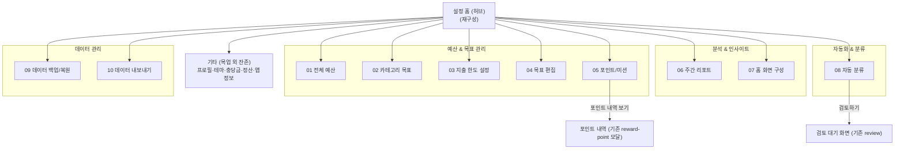

# 설정 10화면 사용자 흐름 (목업 SSOT 기준 수정판)

> 구상 세션 산출물. 입력은 사용자가 제공한 "설정 각 항목 화면" 목업 1장(10화면)과
> 흐름도 3장(개요 + 상세 1/2·2/2)이다. **디자인 SSOT는 목업**이며, 흐름도·기존 계약서와
> 충돌하는 지점은 전부 목업 기준으로 이 문서에서 수정했다(§4 수정 목록).
> 기존 `docs/ai/contracts/settings.contract.md`의 미니멀 허브 결정 중 목업과 충돌하는
> 부분(포인트 폼 설정 제거 등)은 사용자 지시로 **본 문서가 우선**한다.

- 흐름 이름: 설정 홈 + 10개 독립 설정 화면
- 목적: 설정 홈에서 10개 항목으로 각각 독립 진입해 예산·목표·한도·포인트/미션·리포트·홈 구성·자동 분류·백업·내보내기를 관리한다. 순차 흐름이 아니다.
- 상태: `confirmed` (사용자 지시 2026-07-24: 목업 SSOT, 중복 통합, 미니멀 구현)
- 마지막 갱신: 2026-07-24

## 1. 화면 그래프



- 모든 항목은 설정 홈에서 **독립 진입**하며, 저장/완료 후 **설정 홈으로 복귀**한다
  (흐름도의 "설정 홈 또는 현재 화면 맥락" 모호성 → 설정 홈 복귀로 확정).
- 즉시 반영형 화면(02·04·05·07·08)은 뒤로가기가 곧 복귀다. 명시 저장형 화면(01·03)은
  미저장 변경이 있으면 **이탈 확인(변경 폐기 확인)** 을 거친다 — 흐름도에 없던 가드를 추가.

| 화면 | 저장 모델 | 기존 코드 재사용 |
| --- | --- | --- |
| 01 전체 예산 | 명시 저장(저장하기) | settings repo, domain/transactions/budget.js |
| 02 카테고리 목표 | 행 단위 즉시 저장 | features/settings/budget-goals (monthlyTargets) |
| 03 지출 한도 설정 | 명시 저장(저장하기) | 카테고리 금액은 02와 **동일 데이터** |
| 04 목표 편집 | 즉시 반영 | categories order/토글 |
| 05 포인트/미션 | 즉시 반영 | rewardSavings·reward_point_entries |
| 06 주간 리포트 | 저장 없음(조회) | features/report 차트 유틸 |
| 07 홈 화면 구성 | 즉시 반영 | homeManagedCategoryIds 확장 |
| 08 자동 분류 | 즉시 반영 | domain/receipts/rules.js, subcategory-classifier, review-guide |
| 09 데이터 백업/복원 | 액션형 | 신규 (JSON 스냅샷) |
| 10 데이터 내보내기 | 액션형 | scripts/export-calendar-csv.mjs 로직 이식 |

## 2. 화면별 흐름 (수정 확정판)

### 01 전체 예산
1. 진입 → 이번 달 예산 요약(예산·지출·남은 예산·진행바) 표시.
2. 예산 금액 입력 / (선택) 최근 예산 불러오기.
3. 예산 적용 주기 선택(매월/매주/직접 설정) / (선택) 시작일 설정.
4. 남은 예산 처리 선택(다음 기간으로 이월 / 기간 종료 시 초기화 / 초과 금액만 차감).
   — 용어는 목업의 "초기화·차감"으로 통일(흐름도의 "소멸·적립" 폐기).
5. 예산 안내 기준 토글(70% / 90% / 초과) — 저장 시 함께 적용.
6. 저장하기 → 저장 완료 → 설정 홈 복귀. 미저장 이탈 시 폐기 확인.

### 02 카테고리 목표
1. 진입 → 전체 예산 / 배정 합계 / 미배정 요약 표시(01의 예산이 분모).
2. (선택) 자동 배분 → 미배정액을 추천 비율로 분배(확인 후 반영).
3. 카테고리 행 탭 → 목표 금액 인라인 편집 → **행 단위 즉시 저장**(흐름도의 "저장하기" 종점 폐기 — 목업에 저장 버튼 없음).
4. (선택) + 카테고리 추가 → 이름/이모지 입력 → 목록에 추가(상세흐름 누락분 복원).
5. 진행률 %는 사용액/목표 표시 전용(흐름도의 "비율 목표 설정"은 스펙 아님).

### 03 지출 한도 설정
1. 진입 → 기본 경고 단계(주의 70% / 경고 90% / 초과 100%) 링 표시·수정.
2. 기본 기준 선택: "모든 카테고리에 기본 단계 사용" ↔ "카테고리별 개별 단계 사용"
   (목업 드롭다운의 의미를 이것으로 확정 — 개요·상세흐름의 상이한 정의 폐기).
3. 카테고리별 한도 목록 — **금액은 02의 목표 금액을 그대로 표시**(별도 한도 금액 없음, 중복 통합).
4. (선택) 카테고리 행 → 경고 단계 오버라이드 편집(예: 80%/95%/110%).
5. 저장하기 → 저장 완료 → 설정 홈 복귀. 01의 안내 토글과 합쳐 하나의 알림 설정 체계
   (전체 예산용 on/off + 카테고리용 단계)로 저장.

### 04 목표 편집
1. 진입 → 카테고리(목표) 행 목록: 각 행에 자동 관리 토글 — **즉시 반영**.
2. 우상단 "편집" → 순서 변경(드래그)·삭제 모드. 삭제 시 확인.
3. + 새 목표 추가 → 카테고리 선택/생성 후 목록에 추가.
4. 개요흐름의 목표 유형(생활/지출/저축/스마트)·보상·색상·난이도 설정은 **스펙 아님**(목업에 없음 — 폐기).
5. 하단 저장/적용 버튼 없음. 뒤로가기 = 완료.

### 05 포인트/미션
1. 진입 → 내 포인트 총액·이번 달 획득·사용 예정 표시(기존 rewardSavings 데이터).
2. 진행 중 미션 목록(제목·보상P·진행률·남은 일수) / (선택) 모든 미션 보기.
3. 미션 설정: 신규 미션 자동 참여 토글, 난이도(보통/높음) — 즉시 반영.
4. 하단 CTA는 **"포인트 내역 보기"**(개요흐름의 "미션 둘러보기" 폐기) → 기존 포인트 내역 모달.
5. 상세흐름의 "최근 완료 확인" 섹션은 스펙 아님(목업에 없음 — 폐기).

### 06 주간 리포트
1. 진입 → 주 단위 기간 선택(기본: 이번 주).
2. 요약 지표: 총 지출 · **전주 대비**(흐름도 "전년 대비" 오기 정정) · 예산 대비 진행바 · **무지출 일수**(흐름도 "평균 일수" 오기 정정).
   예산 대비 분모 = 월 예산의 주 안분(월 예산 × 해당 주 일수/해당 월 일수). 01에서 주기를 "매주"로 설정한 경우 주 예산 그대로.
3. 카테고리 분석: 도넛 차트 + 비중 리스트.
4. **주간 하이라이트**(가장 많이 증가한 지출 / 가장 많이 감소한 지출 / 반복 지출 건수)
   — 흐름도의 "주간 포인트(지출 TOP·절약 아이디어·소비 패턴)"는 목업 기준으로 교체, 명칭도 05 포인트와의 충돌 해소.
5. 이미지로 공유(공유 시트) / PDF 저장. 흐름도의 "리포트 설정 변경(자동 생성·기준 요일·비교 기준)" 섹션은 스펙 아님(목업에 없음 — 폐기, 비교 기준은 전주 대비 고정).

### 07 홈 화면 구성
1. 진입 → 표시 중인 카드 목록(순서 = 홈 표시 순서).
2. 카드별: on/off 토글 · 표시 형태(상세히/간단히) · 드래그 순서 변경 — **즉시 반영**
   (상세흐름의 "적용하기" 일괄 모델 폐기 — 목업에 적용 버튼 없음).
3. 추가 가능한 카드(최근 거래 / 예산 요약 / 소비 캘린더) 토글 on → 표시 목록으로 이동.
4. 기본값으로 초기화 → 확인(취소=유지 / 확인=기본 구성 적용).
5. 상세흐름의 "홈 화면 미리보기" 단계는 스펙 아님(목업에 없음 — 폐기).
6. 개요흐름의 하단 CTA "검토하기"는 **오기**(08의 CTA) — 본 화면 CTA는 "기본값으로 초기화".

### 08 자동 분류
1. 진입 → 자동 분류 사용 토글 — 즉시 반영.
2. 분류 방식 선택(모든 거래 자동 분류 / 높은 확률 거래만 자동 분류), 확신도 기준(엄격/균형/느슨) — 즉시 반영.
3. 사용자 규칙 목록: 키워드→카테고리, 금액 조건→카테고리. **목록 순서 = 우선순위**(위가 먼저 매칭)
   — 개요흐름의 "규칙 우선순위 설정"을 별도 UI 없이 순서로 해결(규칙 충돌 해소: 예: "스타벅스" 규칙이 "10,000원 미만" 규칙보다 위면 카페로 분류).
4. + 규칙 추가 / 규칙 행 → 편집·삭제. 변경은 즉시 저장·자동 반영(흐름도의 "저장/자동 반영" 모호성 → 자동 반영으로 확정).
5. 검토 필요 거래 N건 표시 → 하단 CTA "검토하기" → 기존 검토 대기 화면으로 이동(개요흐름의 CTA "규칙 추가"는 인라인 버튼으로 정정).

### 09 데이터 백업/복원
1. 진입 → 백업 상태(마지막 백업 일시·크기·저장 위치·정상 배지).
   저장 위치는 **로컬 파일(JSON 스냅샷)** — 목업의 "iCloud"는 웹앱에서 성립하지 않아 편차 처리(§5).
2. 자동 백업 토글·주기(매주 등)·Wi-Fi에서만·배터리 부족 시 제외 — 설정값 저장
   (웹 환경 제약으로 자동 실행은 "앱 실행 중 주기 도래 시 백업 안내"로 미니멀 구현).
3. 백업 범위 확인(거래 내역 / 예산 및 목표 / 카테고리 규칙 / 홈 화면 설정).
4. A. 지금 백업 → JSON 파일 생성·다운로드 → 완료 표시 + 백업 상태 갱신.
5. B. 백업에서 복원 → 백업 파일 선택 → 복원 전 확인(백업 정보 표시) →
   **복원 직전 현재 데이터 자동 안전 백업**(흐름도에 없던 안전 단계 추가) → 복원 진행 → 복원 완료.

### 10 데이터 내보내기
1. 진입 → 기간 선택(이번 달 기본).
2. 내보낼 데이터 체크: 거래 내역 / 예산 및 목표 / **카테고리 목표**(상세흐름 "카테고리 및 규칙" 폐기 — 목업 기준) / 포인트 내역 / 주간 리포트.
3. 파일 형식: CSV / Excel / PDF. PDF는 요약본 형식(상세흐름 주석 유지 — 원자료는 CSV/Excel).
4. 세부 옵션: 메모 포함 / 결제 수단 포함 / 취소 거래 포함 토글.
5. 파일 만들기 → 생성 완료 → 시스템 공유 시트(Web Share API, 미지원 시 다운로드).
6. 상세흐름의 "파일 미리보기" 단계는 스펙 아님(목업에 없음 — 폐기).

## 3. 통합 결정 (중복 해소)

| 중복 | 통합 방침 |
| --- | --- |
| 02 목표 금액 vs 03 한도 금액 | **단일 데이터**: 카테고리 `monthlyTargets`. 03은 금액을 만들지 않고 경고 단계만 소유 |
| 01 예산 안내(70/90/초과) vs 03 경고 단계 | 하나의 알림 설정: 전체 예산용 토글 3개 + 카테고리용 기본 단계 + 카테고리별 오버라이드 |
| 04 목표 vs 02 카테고리 | 04의 "목표" = 02와 동일한 카테고리 집합. 04는 노출/자동 관리/순서만 담당 |
| 04 난이도 vs 05 난이도 | 04에서 폐기, 난이도는 05 미션 설정에만 존재 |
| 05 포인트 vs 기존 rewardSavings | 기존 pointItems·reward_point_entries 재사용. "미션"만 신규 개념 |
| 06 "주간 포인트" 명칭 | "주간 하이라이트"로 개칭(포인트 용어 충돌 해소) |
| 07 vs 기존 homeManagedCategoryIds | 카드 구성 모델로 확장(기존 값은 카테고리 요약 카드 설정으로 흡수) |

목업 예시 수치(카테고리 합계가 배정 합계 초과, 주간 지출=월 남은 예산 등)는 **비규범(non-normative)** 으로 확정 — 레이아웃·구성만 SSOT, 수치는 실데이터.

## 4. 흐름도 수정 목록 (원본 대비)

| # | 위치 | 원본 흐름도 | 수정 (목업 기준) |
| --- | --- | --- | --- |
| 1 | 02 | 종점 "저장하기 → 저장 완료" | 행 단위 즉시 저장, 저장 버튼 없음 |
| 2 | 02 상세 | 카테고리 추가 경로 누락 | "+ 카테고리 추가" 단계 복원 |
| 3 | 02 개요 | "금액 또는 비율" 목표 | 금액 목표만(%는 진행률 표시) |
| 4 | 03 | 기본 기준 정의 3종 상이 | "기본 단계 공통 ↔ 카테고리별 개별"로 확정 |
| 5 | 04 개요 | 유형/보상/색상/난이도 설정 | 폐기(목업에 없음) |
| 6 | 04 | 종점 "적용하기/반영 또는 완료" | 즉시 반영, 뒤로가기=완료 |
| 7 | 05 | 하단 CTA "미션 둘러보기", "최근 완료" 섹션 | CTA "포인트 내역 보기", 최근 완료 폐기 |
| 8 | 06 상세 | "전년 대비/평균 일수" | "전주 대비/무지출 일수"(오기 정정) |
| 9 | 06 상세 | "주간 포인트", "리포트 설정 변경" 섹션 | "주간 하이라이트"로 교체, 리포트 설정 폐기 |
| 10 | 07 개요 | 하단 CTA "검토하기"(오기) | "기본값으로 초기화" |
| 11 | 07 상세 | "미리보기" 단계, "적용하기" 일괄 적용 | 폐기, 즉시 반영 |
| 12 | 08 개요 | "규칙 우선순위 설정" UI 부재 모순 | 목록 순서=우선순위로 해결 |
| 13 | 08 | "저장/자동 반영" 모호 | 자동 반영 확정 |
| 14 | 09 상세 | 복원 안전장치 없음 | 복원 직전 자동 안전 백업 추가 |
| 15 | 10 | "카테고리 및 규칙" vs 목업 "카테고리 목표", "파일 미리보기" | 목업 기준 "카테고리 목표", 미리보기 폐기 |
| 16 | 공통 | 복귀 지점 "설정 홈 또는 현재 화면" 모호 | 설정 홈 복귀 + 명시 저장 화면 이탈 가드 |

## 5. 목업 외 항목 (편차 — 최종 보고 대상)

1. **09 iCloud** → 웹 PWA라 불가. 로컬 JSON 파일 백업/복원으로 대체.
2. **09 자동 백업 백그라운드 실행** → 웹 제약. 앱 실행 중 주기 도래 시 안내로 대체.
3. **기존 설정 기능 중 목업 10화면에 없는 것** → 설정 홈 하단 "기타" 그룹에 최소 행으로 잔존:
   프로필/로그아웃 · 테마 · 충당금 관리 · 정산(바로가기+규칙) · 앱 정보(버전/APK).
   DayBird 연동은 기존 확정대로 설정에서 제외 유지.
4. `docs/ai/contracts/settings.contract.md`의 "보상 폼 설정 제거" 결정은 목업 05가 우선하므로 폐기(포인트/미션 화면 신설).

## 6. 프로토타입 확인법

```bash
npm run dev
```

- 진입 URL: `http://localhost:5501/?fixture=basic` → 설정 탭.
- 각 항목 화면은 설정 홈 행 탭으로 진입(기존 drill-in 모달 인프라 재사용).
