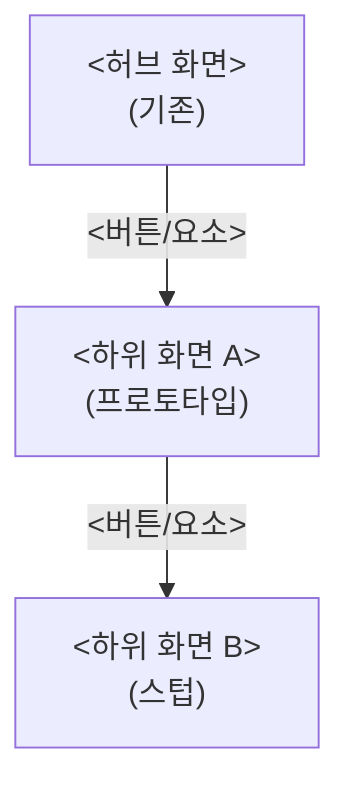

# <흐름 이름> 사용자 흐름

> 사용법: 이 파일을 복사해 `docs/ai/flows/<flow-slug>.md`로 만든다.
> **작성 주체는 AI다.** 구상 세션에서 AI가 사용자의 허브 화면 구상 하나로부터 화면 그래프를 뻗어나가며
> 하위 화면·연결점·흐름 초안을 채운다. 사용자에게 전체 구상을 요구하지 않는다.
> 갈리는 연결·동작만 §4 미확정 연결(객관식 + 추천안)로 남기고, 미답변은 기본값 + `가정`으로 표시한다.
> 이 문서는 "화면들이 어떻게 이어지고 무엇을 하는가"의 초안이다. 화면 단위 상세 계약은
> `docs/ai/contracts/<screen>.contract.md`가 맡는다. 시각 기준은 `docs/design-system.md`의 몫이다.

- 흐름 이름: <이름>
- 목적: <이 흐름으로 사용자가 무엇을 이루는가 — 한두 줄>
- 상태: `draft` | `confirmed` (§4 미확정 연결이 모두 답변/가정 처리되면 `confirmed`)
- 마지막 갱신: YYYY-MM-DD

## 1. 화면 그래프

허브 화면과 거기서 파생되는 화면 목록, 그리고 버튼→대상 이동. 각 노드에 구현 상태를 표기한다.

구현 상태 표기:

- **기존**: 이미 앱에 있는 화면(재사용).
- **프로토타입**: 이번 구상 세션에서 fixture로 조립한 클릭 가능한 화면.
- **스텁**: 아직 미확정이라 비활성 + "준비중"으로만 존재하는 화면·동작.



| 화면 | 구현 상태 | 연결된 계약서 |
| --- | --- | --- |
| 예: 홈(허브) | 기존 | `docs/ai/contracts/home.contract.md` |
| 예: 하위 화면 A | 프로토타입 | `docs/ai/contracts/<a>.contract.md` |
| 예: 하위 화면 B | 스텁 | _(경화 시 작성)_ |

## 2. 흐름 시나리오

번호를 매긴 단계로 "사용자가 X를 한다 → 시스템이 Y를 보여준다"를 기술한다.

예: **홈 잔액 확인 흐름**

1. 사용자가 홈(허브)에 진입한다 → 시스템이 이번 사이클의 써도 되는 돈과 쓴 돈을 히어로에 보여준다.
2. 사용자가 히어로의 기간 라벨(날짜 pill)을 누른다 → 시스템이 기간 설정 모달을 연다.
3. 사용자가 2주 ↔ 달을 전환한다 → 시스템이 해당 기간 집계로 히어로·추세선·라벨을 갱신한다.
4. 사용자가 카테고리 도넛의 한 범례를 누른다 → 시스템이 그 카테고리의 거래 목록 모달을 연다.

## 3. 프로토타입 확인법

```bash
npm run dev
```

- 진입 URL: `http://localhost:5501/?fixture=<scenario>`
- `<scenario>`는 `test/fixtures/e2e/<scenario>.json` (시나리오 추가법은 `docs/ai/e2e-guide.md` 참조).
- 스텁 화면·동작은 비활성 + "준비중"으로 보인다. 운영 데이터 경로(Firestore 쓰기)는 연결되지 않는다.

## 4. 미확정 연결 (객관식 질문)

AI가 결정할 수 없는 갈리는 연결·동작만 남긴다. 화면 계약서 §4와 동일 형식.

### Q1. <질문 — 예: 하위 화면 A의 저장 버튼은 어디로 돌아가는가>

- (a) <선택지> **← 추천**
- (b) <선택지>
- 추천 사유: <한 줄>
- 사용자 답변: _(미답변)_
- 미답변 시 적용 기본값: (a) — `가정`

답변되면 §1 화면 그래프·§2 시나리오에 반영하고 질문을 "답변됨: (a)"로 갱신한다.

## 5. 연결된 화면 계약서

이 흐름이 확정되면 화면별로 다음 계약서를 `confirmed`로 올린다.

- `docs/ai/contracts/<screen>.contract.md` — <역할>
- `docs/ai/contracts/<screen>.contract.md` — <역할>

각 계약서의 "완료 기준 연결" 섹션이 단위 테스트·E2E 스펙을 가리키게 한다(경화 단계).
